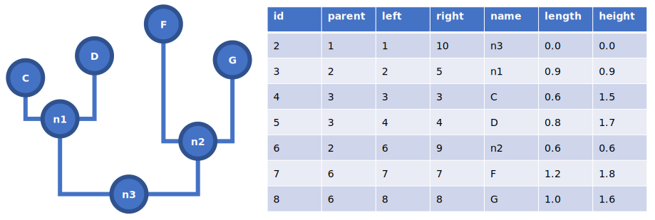

# Abstract

1. Growing numbers of very large phylogenetic syntheses are being 
   published. Sometimes to serve as part of the framework within
   which a hypothesis is being tested, sometimes to present the 
   outcomes of novel methods of phylogenetic inference, and sometimes
   as a snapshot of the molecular diversity within a large group.
   Commonly used methods to reuse these trees in scripting 
   environments have their limitations.   
2. I present a toolkit that transforms data presented in the most
   commonly used format for such trees into a database schema that
   facilitates quick topological queries. Specifically, the need for 
   recursive traversal commonly presented by schemata based on 
   adjacency lists is largely obviated. This is accomplished by 
   computing pre- and post-order indexes and node heights on the 
   topology as it is being ingested.
3. The resulting toolkit provides several command line tools to 
   do the transformation and to extract subtrees from the resulting
   database files. In addition, library code with object-relational 
   mappings that integrate with Bio::Phylo are provided. To 
   demonstrate the utility of the general approach I also provided
   database files for trees provided by Open Tree of Life, Green 
   Genes, D-PLACE, PhyloTree, the NCBI taxonomy and the recently 
   published, largest estimate of plant phylogeny to date.
4. The database files that the toolkit produces are highly portable
   (either as SQLite or tabular text) and can readily be queried,
   for example, in the R environment. Programming languages with 
   mature frameworks for object-relational mapping and phylogenetic 
   tree analysis, such as Python, can use these facilities to make
   much larger phylogenies conveniently available to 
   researcher-programmers.

### Keywords    

phylogenetics, scripting, databases, topological queries, 
object-relational mapping

# Introduction

The estimates of phylogeny that appear in the literature are continuing
to get larger and larger. The contexts within which these trees appear
vary somewhat. In some cases, the tree is constructed as a 'one off'
estimate that was required in order to test a hypothesis in a phylogenetic 
comparative framework (e.g. [Zanne:2014]). In other cases, the tree is
the outcome of an initiative to produce such trees and is thus a 
demonstration of the method (e.g. [Hinchliff:2015], [Smith:2018]). In yet 
other cases, the trees are provided as snapshots of the diversity contained 
in a database (e.g. [vanOven:2009], [Kirby:2016], [Federhen:2011], 
[DeSantis:2006]). 

All these data coming publicly available is a wonderful development. 
However, the format in which these data are published is not necessarily 
the most convenient from the perspective of programmatic reuse. Most 
commonly, phylogenetic trees of this size are made available in the Newick 
format ([Newick]), as other formats (e.g. [Nexus], [NeXML]) add verbosity 
in exchange for a potential level of richness of annotation that is not
needed in this case anyway. From the perspective of conciseness when 
transmitting tree files, Newick is thus a sensible choice. However, the
researcher-programmer who wants to reuse such a tree in a scripting 
environment is then faced with the need to parse text containing the 
parenthetical tree description and load some kind of graph structure or
object into memory every time the script is run. With large trees, this
takes a lot of time and consumes a lot of working memory.

An alternative approach is to ingest the tree file into a portable, 
on-disk database as a one-time operation, and then access the tree data
through a database handle. Subsequently, there is no more complex text
parsing, and the tree does not have to be loaded into memory to be able 
to query its topology. To exploit these advantages, the NCBI taxonomy 
([Federhen:2011]) is distributed in the form of database tables, for
example. In that case, and indeed in most cases where trees that might
be polytomous are represented in databases, the topology is captured
using adjacency lists, where each database record for a node (except 
the root) contains a reference to its parent by way of a foreign key
relation. The downside of this is that tree traversal requires recursive
queries: to get from a tip to the root, each focal node along the path
has to be visited in turn to look up its foreign key relation to its 
parent. This is relatively slow. A possible solution to this is to
use relational database engines that can compute transitive closures,
but not all commonly-used engines support those and the computation
imposes additional computational cost on the ones that do.

Pre-computing additional values and indexes as column values can obviate
the need for some of these traversals entirely, thereby speeding up tree
traversal significantly. The general idea is illustrated in Fig 1. The
topology shown is represented in the table, with one record for each node,
by way of the following columns:

- **name** - the label (if any), i.e. the values in this column 
  correspond to those in the tree.
- **length** - the branch length (if any).
- **id** - a primary key, which is generated as an autoincrementing 
  integer.
- **parent** - a foreign key, whose value references the primary key,
  i.e. the **id**, of the parent node.
- **left** - an index that is generated as an autoincrementing integer
  in a pre-order traversal, i.e. moving from root to tips, parent nodes
  are assigned the index before their child nodes.      
- **right** - an index that is generated as an autoincrementing integer
  in a post-order traversal, i.e. moving from root to tips, child nodes
  are assigned the index before their parents. That is, "on the way back"
  in the recursion.
- **height** - the node height, i.e. the distance from the root.

Like most relational database implementations of trees, i.e. using
adjacency lists, the children of _n1_ can be select like so (returning 
_C_ and _D_):

```sql
select CHILD.* from node as PARENT, node as CHILD
  where PARENT.name='n1'
  and PARENT.id==CHILD.parent;
```

Likewise, the parent of node _C_ can be selected like so (returning 
_n1_):

```sql
select PARENT.* from node as PARENT, node as CHILD
  where CHILD.name='C'
  and PARENT.id==CHILD.parent;
```

Beyond that, and with the aid of the additional indexes, traversals that 
would otherwise require recursion can now be executed as a single query. 
For example, to identify the most recent common ancestor of (MRCA) of input 
nodes C and F, we can formulate in SQL:

```sql
select MRCA.* from node as MRCA, node as C, node as F 
  where C.name='C' and F.name='F' 
  and MRCA.left < min(C.left,F.left) 
  and MRCA.right > max(C.right,F.right)
  order by MRCA.left desc limit 1;
```

The query selects the nodes whose **left** index is lower, and whose 
**right** index is higher than that of either of the input nodes. This
limits the result set to those nodes that are ancestral to both. By then
ordering these on the **left** index in descending order they are ranked
from most recent to oldest. Limiting the result set to only the first
record in this ordered list returns the most recent common ancestor. 
Alterations to the query to obtain, for example, all ancestors to both
(or either) input nodes should be readily apparent. Similar filtering can 
also be applied to identify all tips subtended by an input node:

```sql
select TIP.* from node as TIP, node as ROOT 
  where ROOT.name='n3' 
  and TIP.left > ROOT.left 
  and TIP.right < ROOT.right
  and TIP.left == TIP.right;
```

In this query, the filtering on **left** and **right** indexes is applied 
as a means to define the ingroup. Furthermore, the property of the indexes
that they are not incremented on terminal nodes between the way in (the 
pre-order traversal) and the way out (post-order) is exploited to select 
them using the predicate of equality of their indexes. Lastly, the 
precomputed node heights can be exploited, for example, to compute patristic
distances between nodes, such as:

```sql
select (C.height-MRCA.height)+(F.height-MRCA.height) 
  from node as MRCA, node as C, node as F 
  where C.name='C' and F.name='F' 
  and MRCA.left < min(C.left,F.left) 
  and MRCA.right > max(C.right,F.right)
  order by MRCA.left desc limit 1;
```

In this query, the final result is 3.3, i.e. the sum of the heights of C
and F as the root has no height. Other calculations that take advantage
of the extra indexes are also possible as single queries. For example,
several indexes of the tendency of nodes towards the tips (such that the 
tree is "stemmy") or towards the root ("branchy")  are used to summarize
the mode of diversification in a clade (here, apparently accelerating or 
slowing down, respectively). One of these [Fiala:1985] iterates over all
internal nodes and for each calculates the ratio of the focal node's branch
length over the sum of descendent branch lengths plus the focal length
and then averages over these ratios. This can be expressed in a single query:

```sql
select avg(ratio) from (
   select INTERNAL.length/(sum(CHILDREN.length)+INTERNAL.length) as ratio 
        from node as INTERNAL, node as CHILDREN 
        where INTERNAL.left!=INTERNAL.right
        and CHILDREN.left>INTERNAL.left
        and CHILDREN.right<INTERNAL.right
	    and INTERNAL.parent!=1 
	    group by INTERNAL.id
)
```

These examples should serve to illustrate that access to large tree 
topologies indexed in this way is quite powerful, especially when integrated
in scripting environments that provide additional functionality. The toolkit
presented here provides such access.

# Materials and Methods

## Database schema and object-relational mapping

The database schema that provides the functionality described in the 
Introduction is shown in Table 1. In addition to the column names and their
data types, shown are the indexes for the database engine to compute. To avoid 
confusion with the usage of 'index' elsewhere in this manuscript, what is referred 
to here are B-Trees that the database engine computes for internally organizing
and searching the data held by a column (or combination of columns) to allow
it to find matches more quickly, sort result sets, and enforce certain 
constraints (such as uniqueness). In other words, this is something else than
the topological indexing described at greater length in this paper. Nevertheless,
these B-Tree indexes also influence performance greatly so I note them here in the
interest of any re-implementations by readers.

As the database consists of a single table, mapping its structure onto 
an object-oriented class is straightforward. Many programming languages have
tools for this; commonly-used examples are Hibernate for the Java programming
language and SQLAlchemy for Python. In the present case, I opted for the
functionality of DBIx::Class in Perl. I then modified the generated code somewhat 
so that it inherits from a tree node class of Bio::Phylo [Vos:2011], providing 
it with the additional functionality of this package (e.g. export to various 
flat file formats and tree visualization). Infeasibly large phylogenies can 
thus be programmed like an other tree object that Bio::Phylo operates on. 
However, their infeasability extends to their being readable in the first place, 
or anyhow in a paradigm where they are loaded into runtime memory. Hence, 
populating databases with them required some custom programming, described in 
the next section. 

## Populating databases

The general method for processing input parenthetical statements and emitting 
these as database records of the form discussed in the Introduction can
be described by way of the following prose algorithm.

1. Apply an auto-incrementing label to each node, i.e., reading the 
   tree statement from left to right, append a unique identifier
   to each closing parenthesis. Closing parentheses with non-standard 
   semantics (e.g. as part of references to taxonomic authorities in tip 
   labels, which consequently would likely by single or double quoted) are 
   ignored. The same careful tokenization, taking into account the Newick
   rules (loosely observed as they are) for single and double quoting, 
   spaces, and square bracketed comments, must be applied dilligently to 
   identify the other symbols in the next steps as well.    
2. Remove the closing semicolon of the parenthetical statement. From here
   on, every nested taxon including the entire tree is syntactically self-same:
   it may have a branch length (the last colon symbol followed by a number) 
   and is either an internal node, tagged using the labeling scheme from step 
   1, or a terminal node.
3. Emit the focal taxon to the database handle. In the initial root case,
   no parent of the focal taxon is in the tree, and so the default value
   for **parent** is used, i.e. 1. The **length** and **name** are parsed
   out of the string. An **id** is generated as an auto-incrementing integer
   and is stored as the value for **name** in a lookup table (hash table,
   dictionary). In cases besides the root case, the name of the parent of
   the focal taxon is known, and so the non-default value for **parent**
   is fetched from the lookup table. What is passed to the database handle 
   is thus a new record with values for the fields **id**, **parent**, 
   **name**, and **length**.
4. Strip the outermost set of decorated parentheses (if any) from the 
   tree string, storing the parent label attached to the closing parenthesis. 
   Split the remaining string in the two or more (in case of polytomies) 
   direct children, by scanning for comma symbols that are not nested inside 
   parentheses. This involves keeping track of the nesting levels of opening 
   and closing parentheses while scanning through the string. Pass each of 
   these direct children to step 3. The recursion between 3 and 4 will 
   continue until all taxa have been emitted.
5. The Newick string has now been consumed. In a second pass, the **left**
   and **right** indexes, and the node **height** are computed by traversing
   through the now populated database. Starting with the root (i.e. 
   **parent**==1), a depth-first traversal is performed by recursively 
   fetching the immediate child nodes from the database (as per the first 
   query example from the Introduction). The pre-order processing of the 
   children is to store the value of an auto-incrementing integer as **left**, 
   and the value of **height** as carried over from the parent increased with 
   the value of **length**. After treating any children, the post-order processing
   then applies the value of the auto-incrementing integer (unchanged in the
   case of terminal nodes) to **right**.

I implemented this basic algorithm in a script and applied this to the following, 
large, published Newick trees:

- A tree of human societies backing the D-PLACE global database of cultural, 
  linguistic and environmental diversity [Kirby:2016]. 1,647 nodes using the 
  release that was current as of 04.02.2017.
- A tree of 16S rRNA gene sequences made available by the Greengenes database
  [DeSantis:2006], release `gg_13_5`, current as of 11.10.2017. Contains
  406,903 nodes.
- A synthesis of plant systematics from [Smith:2018], identified as ALLMB.tre,
  version v1.0, current as of 29.08.2019. Contains 440,712 nodes. 
- A synthetic tree provided by the Open Tree of Life project [Hinchliff:2015].
  Identified as v10.4, current as of 24.09.2018. Contains 2,902,755 nodes.

In addition, I implemented two scripts that process tree descriptions in 
proprietary, tabular formats: 

- The tabular dump of the NCBI taxonomy. The database I generated with 
  this is from GenBank release current as of 03.02.2017, and contains 
  1,554,272 nodes.  
- A custom format that captures a tree of Y-chromosome haplotype diversity 
  backing the PhyloTree database [vanOven:2009], build 17, current as of 
  11.10.2017. Contains 5,438 nodes.

# Results

The substantial results of this study comprise a software package that 
includes library code and scripts. The library code introduces two namespaces
compatible with the standardized class hierarchy for Perl5, namely:

- `Bio::Phylo::Forest::DBTree` - a class containing factory methods for
  instantiating databases and utility methods for persisting and extracting
  trees. This subclasses the core tree class in Bio::Phylo and inherits its
  decorations.
- `Bio::Phylo::Forest::DBTree::Result::Node` - the generated object-
  relational mapping classes, modified to inherit from the core tree node
  class of Bio::Phylo. In addition, this class contains several query methods
  of the sort described in the Introduction.   
  
The scripts are:

- `megatree-loader` - the generic Newick tree parser/loader
- `megatree-ncbi-loader` - the parser/loader for NCBI taxonomy dump files
- `megatree-phylotree-loader` - the parser/loader for PhyloTree
- `megatree-pruner` - a utility script for extracting subtrees from a database

Applying the loader scripts to the trees described in the methods section 
resulted in a set of databases and CSV files that can be accessed directly in 
the SQLite shell or 3rd party database browsers, from a scripting environment 
via a database handle, or using the library code presented here. Additional 
databases, or updates, can be generated with the provided scripts. To give an 
example of the processing and indexing time: ingesting the largest tree in the set
(and the largest published phylogeny I am aware of), the Open Tree of Life
release, took approximately one hour on a current MacBook Pro. In other words,
this is a somewhat costly operation that, mercifully, needs to be run only once.
I describe in the section on data availability how to obtain these generated
databases and the tools to make more.

# Discussion

# Conclusions 

# Acknowledgements

Bill Piel, Mannis van Oven

# Authors' contributions

# Data availability

The source code of this project is made available under the same
terms as the Perl5 core itself, i.e. an opportunistic combination 
of the GNU General Public License (v.3) and the Artistic License,
and is being developed further in a git repository at:
https://github.com/rvosa/bio-phylo-forest-dbtree

The version of the software presented in this manuscript has been
stored permanently under a DOI at: https://doi.org/10.5281/zenodo.1035856
and is released through the Comprehensive Perl Archive Network at:
https://metacpan.org/release/Bio-Phylo-Forest-DBTree

The database files discussed in this manuscript are available at
the following locations:

- PhyloTree [vanOven:2009] - http://doi.org/10.6084/m9.figshare.4620757.v1
- D-PLACE [Kirby:2016] - http://doi.org/10.6084/m9.figshare.4620217.v1
- NCBI Taxonomy [Federhen:2011] - http://doi.org/10.6084/m9.figshare.4620733.v1
- Green Genes [DeSantis:2006] - http://doi.org/10.6084/m9.figshare.4620214.v1
- ALLMB [Smith:2018] -  https://doi.org/10.6084/m9.figshare.9747638
- Open Tree of Life [Hinchliff:2015] - https://doi.org/10.6084/m9.figshare.9750509

# References

# Figures and tables



Figure 1: representation of a tree shape in a relational database, with
additional, precomputed indexes and values. See text for details.

| Name   | Type        | Index                |
|--------|-------------|----------------------|
| id     | int         | primary key not null |
| parent | int         | index                |
| left   | int         | index                |
| right  | int         | index                |
| name   | varchar(20) | index                |
| length | float       |                      |
| height | float       |                      |

Table 1: schema for DBTree databases.